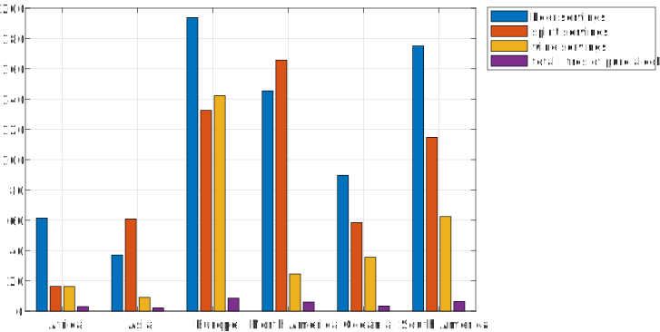

image::https://github.com/soerensofke/MatlabDataFrame/workflows/self-hosted%20runner/badge.svg[]

Fluent – Data Frame for MATLAB
------------------------------

### Install
Past the link below into your MATLAB Command Windows and press return. Done! 
[source, MATLAB]
----
websave('Fluent.m', 'https://bit.ly/Fluent-latest')
----

### Now operate on Data Frames
Use a table-like structure that is supplemented with expressive methods for lean and fast data analysis and exploration.

### Using the fluent interface
:fluent-pattern: https://en.wikipedia.org/wiki/Fluent_interface

By implementeing the {fluent-pattern}[fluent interface pattern], you can programm in a very compact manner, without assigning intermediate results to variables. Just by chaing multiple method calls.

### And write less code
Build boilerplate-free data analysis application in a language you already know -- MATLAB. 

.An example using Fluent would look like this:
[source, MATLAB]
----
Fluent('https://bit.ly/drink-csv').group('continent').mean.bar('continent').print('drinks.svg')
----

.A comparison of alcohol consumption per continent.
[#img-sunset]
[caption="Figure 1 – ", link=https://github.com/soerensofke/Fluent/blob/master/doc/drinks.svg]

.It would propably look something like this in naive MATLAB
[source, MATLAB]
----
%% Load data from web
thisFilename = websave(tempname, 'https://bit.ly/drink-csv');
thisTable = readtable(thisFilename);

%% Identify groups across continents
[g, tid] = findgroups(thisTable(:, 'continent'));
numContinents = height(tid);

%% Determine average alcohol consume per continent
thisTable = removevars(thisTable, {'country', 'continent'});
variableNames = thisTable.Properties.VariableNames;
numVariables = numel(variableNames);

averageConsume = nan(numContinents, numVariables);
for idx = 1:numVariables
    thisVariableName = variableNames{idx};
    averageConsume(:, idx) = splitapply(@mean, thisTable.(thisVariableName), g);
end

%% Plot alcohol consume and beautify the figrue
hFigure = figure();
positionSize = hFigure.OuterPosition;
goldenFactor = (1 + sqrt(5)) * 0.5;
positionSize(3) = positionSize(4) * goldenFactor; %% make wider
hFigure.OuterPosition = positionSize;

hold on; box on; grid on;
bar(averageConsume)
legendString = cellfun(@(x) strrep(x, '_', ' '), variableNames, 'UniformOutput', false);
legend(legendString, 'interpreter', 'none', 'location', 'northeastoutside')
xticklabels(tid{:,'continent'})
set(gca, 'LooseInset', get(gca, 'TightInset'))

%% Finally, print the figrue to svg
print('drinks', '-dsvg')
----
