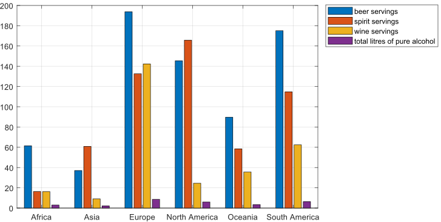

image::https://github.com/soerensofke/MatlabDataFrame/workflows/self-hosted%20runner/badge.svg[]

Fluent – Data Frame for MATLAB
------------------------------

### Install
Past the link below into your MATLAB Command Windows and press return. Done! 
[source, MATLAB]
----
websave('Fluent.m', 'https://bit.ly/Fluent-latest')
----

### Now operate on Data Frames
:panel-data: https://en.wikipedia.org/wiki/Panel_data

Use a {panel-data}[table-like structure] that is supplemented with expressive methods for lean and fast data analysis and exploration.

### Use the fluent interface
:fluent-pattern: https://en.wikipedia.org/wiki/Fluent_interface

You can program very compactly without assigning intermediate results to variables. Just by {fluent-pattern}[chaining method calls].

### And write less code
:boiler-plate: https://en.wikipedia.org/wiki/Boilerplate_code

Build {boiler-plate}[boilerplate]-free data analysis application in a language you already know -- and you will fall in love with MATLAB again. 

_An example using Fluent would look like this:_
[source, MATLAB]
----
Fluent('https://bit.ly/drink-csv').group('continent').mean.bar('continent').print('drinks.svg')
----

_Figure 1 -- Comparison of alcohol consumption per continent._